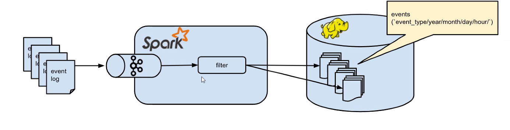

## Anand Patel
# Project 2: Tracking User Activity

In this project, you work at an ed tech firm. You've created a service that
delivers assessments, and now lots of different customers (e.g., Pearson) want
to publish their assessments on it. You need to get ready for data scientists
who work for these customers to run queries on the data.


## Deliverables

- history file: `Anand-Patel-history.txt`

- Report files: `proj2_writeup.md`, `proj2_pyspark_nb.ipynb`

- Any other files needed for the project: `docker-compose.yml`, shell script used `consumeKafka.sh`, `launch_pyspark_nb.sh`, `publishKafka.sh`, `proj2_createKafkaTopic.sh`

- Repo explained in the `README.md`.


## Data

To get the data, run
```
curl -L -o assessment-attempts-20180128-121051-nested.json https://goo.gl/ME6hjp
```

All code assumes data is under `/w205/assessment-attempts-20180128-121051-nested.json`.

## ETL Pipeline Summary

Below is a picture of the ETL pipeline needed for this project. We have data published to a Kafka queue. We are consuming this data into Spark to filter, transform, and do initial data analysis on it. We are saving our transformed data tables to Hadoop File System in the form of parquet files.




# Launching Docker Containers

In this section, I discuss commands used to launch docker containers for the various applications used in this project. I will launch multiple containers through one `docker-compose.yml` file. The contents of the docker-compose file are as follows:

``` yaml
---
version: '2'
services:
  zookeeper:
    image: confluentinc/cp-zookeeper:latest
    environment:
      ZOOKEEPER_CLIENT_PORT: 32181
      ZOOKEEPER_TICK_TIME: 2000
    expose:
      - "2181"
      - "2888"
      - "32181"
      - "3888"

  kafka:
    image: confluentinc/cp-kafka:latest
    depends_on:
      - zookeeper
    environment:
      KAFKA_BROKER_ID: 1
      KAFKA_ZOOKEEPER_CONNECT: zookeeper:32181
      KAFKA_ADVERTISED_LISTENERS: PLAINTEXT://kafka:29092
      KAFKA_OFFSETS_TOPIC_REPLICATION_FACTOR: 1
    expose:
      - "9092"
      - "29092"

  cloudera:
    image: midsw205/cdh-minimal:latest
    expose:
      - "8020" # nn
      - "50070" # nn http
      - "8888" # hue
    #ports:
    #- "8888:8888"

  spark:
    image: midsw205/spark-python:0.0.5
    stdin_open: true
    tty: true
    volumes:
      - ~/w205:/w205
    command: bash
    depends_on:
      - cloudera
    environment:
      HADOOP_NAMENODE: cloudera
    expose:
      - "7000" #jupyter notebook
    ports:
      - "7000:7000" # map instance:service

  mids:
    image: midsw205/base:latest
    stdin_open: true
    tty: true
    volumes:
      - ~/w205:/w205

```

In the docker-compose file, we launch containers for:

- **zookeeper**: used in distributed systems for service synchronization and as a naming registry. When working with Apache Kafka, zookeeper is used to track the status of nodes in the Kafka cluster and maintain a list of Kafka topics and messages. kafka depends on zookeeper, so zookeeper is listed first for launching in the docker-compose file.
- **kafka**: our queue application to publish our assessments data to, and make data available for any applications that needs to access this data stream.
- **cloudera**: this is a distribution of hadoop file system (HDFS) and other hadoop universe tools. In our ETL, we are using cloudera as the distributed storage and we will save our query-able dataset in this system for data scientists to access.
- **spark**: Apache spark is our application for streaming context. We use spark to read in data from kafka, transform it to make it query-able for answering business questions, and save the transformed data to distributed storage.
- **mids**: the mids container gives us access to command line tools, notably kafkacat, to transform the json data for user assessments into an appropriate format for publishing onto a kafka topic.

These containers are brought up by executing:

```
docker-compose up -d
```

This command tells `docker-compose` to execute the docker-compose.yml file to bring `up` the various containers. The `-d` specifies to run in the background, freeing up the terminal this is executed on.

```
docker-compose ps
```
Allows us to view the docker processes running that were launched with docker-compose. We can check that our containers are up and running.

```
docker-compose logs -f kafka
```
This will show logs for docker-compose and the `-f kafka` term searches for kafka in the logs. We use this to check that kafka is running.

We can check that our cloudera hadoop file system is running by executing the following command:

```
$ docker-compose exec cloudera hadoop fs -ls -h /tmp/
Found 2 items
drwxrwxrwt   - mapred mapred              0 2018-02-06 18:27 /tmp/hadoop-yarn
drwx-wx-wx   - root   supergroup          0 2018-02-20 22:31 /tmp/hive
```

This is saying docker-compose execute the tool cloudera hadoop file system (`exec cloudera hadoop fs`) to list (`-ls`) in human readable format (`-h`) the contents of the `/tmp/` directory. The results should show that cloudera is up and if the file we want to write isn't already there. Yarn is present to allow computing on hdfs datanodes and hive is for map reduce using sql statements. Neither of these applications will be used on this project.


# Kafka
## Creating a Kafka topic

Running a shell script to create a kafka topic. Got confirmation that the topic "userAct" was made to publish data about User Activity.
```
$ ./proj2_createKafkaTopic.sh
Created topic userAct.
```
The shell script runs the following command to create a kafka topic:

```
docker-compose exec kafka kafka-topics --create --topic userAct --partitions 1 --replication-factor 1 --if-not-exists --zookeeper zookeeper:32181
```
This says to docker-compose to execute the kafka kafka-topics tool (`docker-compose exec kafka kafka-topics`) and create a topic called userAct (`--create --topic userAct`) with partition of 1 and replicated once if the topic does not already exist (`--replication-factor 1 --if-not-exists`) and let zookeeper manage this kafka topic using the ports set up in the docker-compose file `--zookeeper zookeeper:32181`.

We can check our created userAct kafka topic as follows:

```
docker-compose exec kafka kafka-topics --describe --topic userAct --zookeeper zookeeper:32181
```

```
Topic: userAct  TopicId: LCQPozlWS6CdV9r3aMP6aw PartitionCount: 1       ReplicationFactor: 1    Configs:
        Topic: userAct  Partition: 0    Leader: 1       Replicas: 1     Isr: 1
```

See that the replication factor, partition count, and topic name all match our command.

## Publishing data to Kafka

Using jq to process and look at jsons from the CLI, we can count the lines in our dataset:

Here is code to do a line count on the `assessment-attempts-20180128-121051-nested.json` data:

```
cat ~/w205/assessment-attempts-20180128-121051-nested.json | jq '.[]' -c | wc -l
```

`cat` will concatenate the specified file and print on the standard output. Using `|`,  the standard output of left command is connected  via  a  pipe  to  the  standard  input  of  right command. `q '.[]' -c` is the next command where the json is sent and processed with the jq tool. `jq '.[]'` returns each element of the array returned in the response, one at a time. The `-c` will result in more compact output by not pretty printing, as default, and instead putting each JSON object on a single line. This is piped again to `wc -l` to print line counts for the output of jq commands. We get 3280 elements in the json.

Running a shell script to publish our `assessment-attempts-20180128-121051-nested.json` data to our kafka topic userAct. The message `Produced 3280+ messages.` is a manual `echo` I put at the end of the command to give us a confirmation that our command ran, though it does not confirm that the publishing has worked.
```
$ ./publishKafka.sh
Produced 3280+ messages.
```

The `publishKafka.sh` shell script runs the following command to publish data to our userAct kafka topic:

```
docker-compose exec mids bash -c "cat /w205/assessment-attempts-20180128-121051-nested.json | jq '.[]' -c | kafkacat -P -b kafka:29092 -t userAct && echo 'Produced 3280+ messages.'"
```

This tells docker-compose to execute the mids bash shell `docker-compose exec mids bash` and `-c` says that the contents of the quotations should be executed in that mids bash shell. Inside the mids bash shell, we do the same jq commands as above to get the json element by element, all on one line each. Kafka needs data elements seperated by new line characters, so this is the format a json has to be prior to publishing. We pipe this output to kafkacat tool and publish to a broker using the port for kafka we specified in the docker-compose file `kafkacat -P -b kafka:29092` and the topic name userAct that we made ` -t userAct`.

# Spark: Data Transformation

Now that we have data published to our kafka userAct topic, we can consume it using spark.

## Launching spark
The data transformation via spark can be done from the command line using an ipython shell or it can be done inside of a jupyter notebook in Google Cloud Computing Platform thanks to the exposed ports in the docker-compose file and the notebook set up procedures.

**I will be using a jupyter notebook to run the spark commands to consume and transform our data.** I will go over how to launch spark in the ipython method and how to launch pyspark in a notebook. After this set up explanation, I will be using only the notebook to run the commands and I will reference this notebook for transformation and queries.

### Spark in ipython:

This tells `docker-compose` to execute `spark` and the tool `pyspark` in the command line.

```
docker-compose exec spark pyspark
```

To exit the ipython shell type the command below or `Ctrl+D`:
```
exit()
```

### Jupyter Notebook with pyspark:

Execute my shell script to launch spark and enable pyspark for jupyter notebook.

```
./launch_pyspark_nb.sh
```

This shell script runs the following command to launch spark and enable it in a jupyter notebook.

```
docker-compose exec spark env PYSPARK_DRIVER_PYTHON=jupyter PYSPARK_DRIVER_PYTHON_OPTS='notebook --no-browser --port 7000 --ip 0.0.0.0 --allow-root --notebook-dir=/w205/project-2-Anand-Patel-95/' pyspark
```

The command will execute and return the following:

```
Copy/paste this URL into your browser when you connect for the first time,
    to login with a token:
        http://0.0.0.0:7000/?token=XXXXX
```

Replace the `0.0.0.0` with your VM's external IP address here [GCP VM instances](https://console.cloud.google.com/compute/instances?authuser=4&project=w205-projects&supportedpurview=project). Then paste that url into your browser.


## Switch to Jupyter Notebook for Spark Commands

Please refer to the Jupyter Notebook `proj2_pyspark_nb.ipynb` ([link to notebook](proj2_pyspark_nb.ipynb)), ([link to pdf in case NB fails to load](proj2_pyspark_nb_submission.pdf)) for commands and explanations for using Spark to:

-  Consume data from our kafka topic.
- Save the data to Spark dataframes, inspect contents.
- Transform the data to temporary tables useful for Data Scientists through `.map()` or `.flatMap()`.
- Run Spark SQL queries to answer 6 business questions about the data.
- Save our query-able tables to HDFS distributed storage for Data Scientists.

This notebook is also my Spark history file.

## Checking saved tables in HDFS

After reading through the Jupyter Notebook on Spark procedures, please continue reading here. Going back to the terminal command line, we can check if we successfully saved our tables to HDFS through the command run in Spark. Checking our 3 tables we saved into HDFS from Spark.

```
docker-compose exec cloudera hadoop fs -ls -h /tmp/
```

```
Found 5 items
drwxr-xr-x   - root   supergroup          0 2021-07-02 14:50 /tmp/assessments_tbl
drwxr-xr-x   - root   supergroup          0 2021-07-02 14:55 /tmp/exams_and_scores_tbl
drwxr-xr-x   - root   supergroup          0 2021-07-02 14:50 /tmp/exams_taken_tbl
drwxrwxrwt   - mapred mapred              0 2018-02-06 18:27 /tmp/hadoop-yarn
drwx-wx-wx   - root   supergroup          0 2021-07-02 14:37 /tmp/hive
```

For Q1), Q2), Q3):
```
docker-compose exec cloudera hadoop fs -ls -h /tmp/assessments_tbl
```

```
Found 2 items
-rw-r--r--   1 root supergroup          0 2021-07-02 14:50 /tmp/assessments_tbl/_SUCCESS
-rw-r--r--   1 root supergroup    337.3 K 2021-07-02 14:50 /tmp/assessments_tbl/part-00000-a25a5d72-4889-4969-aa1d-6b38f8b277d4-c000.snappy.parquet
```

For Q4):
```
docker-compose exec cloudera hadoop fs -ls -h /tmp/exams_taken_tbl
```

```
Found 2 items
-rw-r--r--   1 root supergroup          0 2021-07-02 14:50 /tmp/exams_taken_tbl/_SUCCESS
-rw-r--r--   1 root supergroup       1015 2021-07-02 14:50 /tmp/exams_taken_tbl/part-00000-0a5468e1-d119-4674-83c3-a1616892804a-c000.snappy.parquet
```

For Q5), Q6):
```
docker-compose exec cloudera hadoop fs -ls -h /tmp/exams_and_scores_tbl
```
```
Found 2 items
-rw-r--r--   1 root supergroup          0 2021-07-02 14:55 /tmp/exams_and_scores_tbl/_SUCCESS
-rw-r--r--   1 root supergroup    188.5 K 2021-07-02 14:55 /tmp/exams_and_scores_tbl/part-00000-fe140900-7604-4427-9729-1bfcc51ee7f3-c000.snappy.parquet
```

## Taking down docker

This command downs the containers brought up by docker-compose.

```
docker-compose down
```


---
